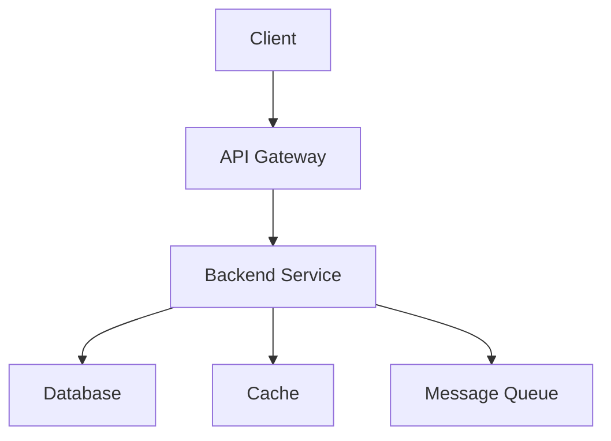

# Architecture Documentation - AITaskManager

## Overview

This document describes the system architecture for AITaskManager.

## Architecture Diagram

## Design Details

# AITaskManager System Design

## 1. ARCHITECTURE OVERVIEW

### System Architecture Description
AITaskManager is a web-based application that allows users to manage tasks. Users can view tasks on a dashboard, access a calendar view, and perform CRUD (Create, Read, Update, Delete) actions on tasks. The system will be designed using a microservices architecture to ensure scalability and maintainability.

### Component Breakdown with Responsibilities
1. **Frontend Application**
   - **UI Dashboard**: Displays tasks for the day.
   - **Calendar View**: Allows users to view tasks in a calendar format.
   - **Task Management Interface**: Interface for creating, editing, and deleting tasks.

2. **Backend Services**
   - **Task Management Service**: Handles business logic related to task CRUD operations.
   - **Calendar Service**: Provides data for the calendar view.
   - **Authentication Service**: Manages user authentication and authorization.

3. **Data Storage**
   - **Primary Database**: Stores tasks, user data, and relevant metadata.
   
4. **API Gateway**
   - Routes requests to appropriate backend services.
   - Provides a single entry point for frontend applications.

5. **Integration Points**
   - **Third-party Calendars**: Option to sync with external calendar services (e.g., Google Calendar).
   - **Notification Service**: Sends reminders and task notifications.

### Data Flow Between Components
1. User interacts with the frontend application.
2. Requests are sent to the API Gateway.
3. API Gateway routes requests to respective backend services.
4. Task Management Service interacts with the database for CRUD operations.
5. Data is aggregated and sent back to the frontend for display.

### Integration Points
- API for third-party calendar synchronization.
- Webhooks for notification services (email, web notifications, etc.).

## 2. ARCHITECTURE DIAGRAM (Mermaid format)
I will create a Mermaid diagram to visualize the architecture.
[Tool create_diagram result: {'status': 'created', 'diagram_type': 'architecture', 'format': 'mermaid', 'title': 'AITaskManager System Architecture', 'content': 'graph TD\n  A[Frontend] --> B[Component B]'}]

---
*Generated by Agent Team Framework*
